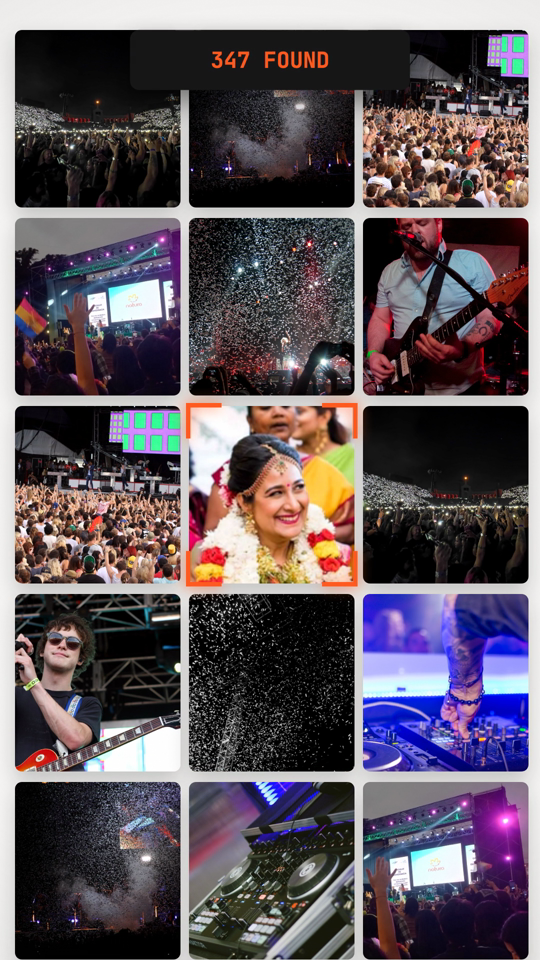
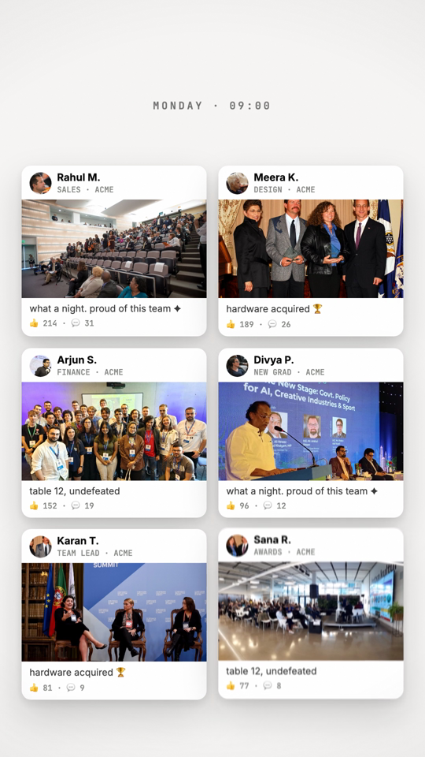
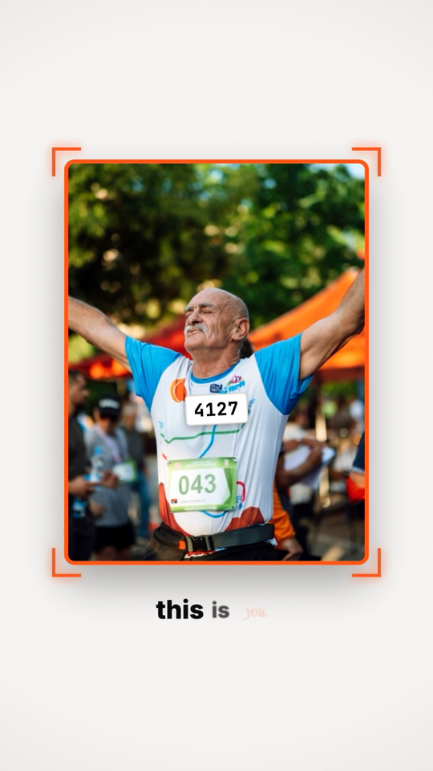
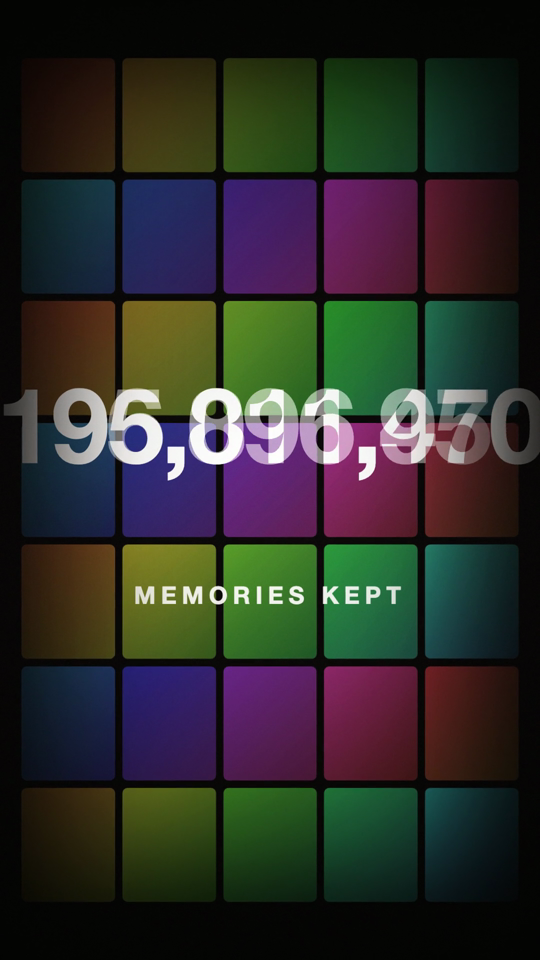
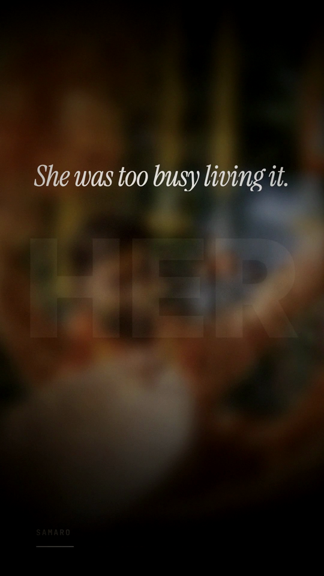
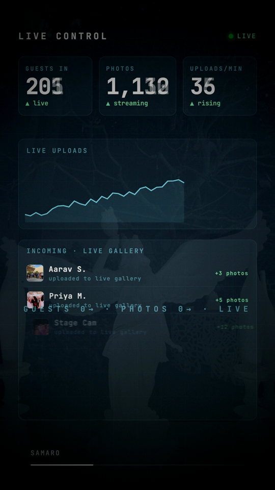

# 🎬 reelkit

Two AI video pipelines packaged as a **Claude Code plugin**. Hand Claude a short per-company
brief + a reference video, and it builds a branded vertical reel — no re-explaining the pipeline
each time. The *method* lives in the plugin; the *content* lives in your brief, so it works for
any brand.

| Skill | Makes | Pipeline |
|---|---|---|
| **reel-liveaction** | Hype/promo reel from real footage, matched to a reference song | demucs + faster-whisper + librosa → editmap → rembg person-matte → ffmpeg compositing |
| **reel-mograph** | Animated typography / feature / launch films (no footage) | GSAP timeline in HTML → headless-Chromium frame stepping → motion-blur supersample → ffmpeg + SFX |
| **reel-scripting** | Bar-addressed production scripts + multi-reel campaigns | pick track → librosa beat grid → BRIEF + per-reel SCRIPT → parallel builder agents (preview-only) → serial renders |
| **asset-casting** | License-safe hi-res photo sets, cast like a movie | Wikimedia Commons + Openverse harvest (keyless) → director-style curation → license manifest |

Claude auto-picks **reel-liveaction** when the brief has footage, **reel-mograph** otherwise —
and loads **reel-scripting** first for any 30s campaign reel (music-first beat locking is the
single biggest quality lever we've measured).

---

## ▶ See it in action

Films this pipeline produced — every one rendered from a GSAP timeline, no footage, no manual
editing. **Click a thumbnail to play** (web previews 540×960, ~1 MB; the pipeline outputs full 1080×1920).

**v0.2 campaign** — four beat-locked use-case reels, written + built + rendered in one session:

| [](examples/fest-mode.mp4) | [](examples/same-night.mp4) | [](examples/monday-9am.mp4) | [](examples/bib-4127.mp4) |
|:---:|:---:|:---:|:---:|
| Fest Mode | Same Night | Monday 9AM | Bib 4127 |

**v0.1 films:**

| [](examples/dont-blink.mp4) | [](examples/living-invitations.mp4) | [](examples/face-search.mp4) | [](examples/live-dashboard.mp4) |
|:---:|:---:|:---:|:---:|
| Don't Blink¹ | Living Invitations | Face Search | Live Dashboard |

¹ built end-to-end by Claude in **66 s** on an 8 GB Mac — 780 frames @ 1080×1920, a counter racing to 200,000,000, dense sound design.

---

## Campaign mode — several reels, one system (v0.2)

Proven on a 4-reel product campaign (fest / photographer / corporate / marathon), all four written,
built, and rendered in one session on an 8 GB Mac:

1. **Music first.** `extract_beats.py` analyzes every candidate track (tempo + energy), cuts a bed
   per reel at an energetic bar, and emits `beats.json` — the reel's ground-truth grid.
2. **One BRIEF, N SCRIPTs.** A shared brand/motion/sound system + one exhaustive, *bar-addressed*
   production script per reel (exact px layouts, every cue with time+gain, climax frame-by-frame).
   Bar addressing means any script re-locks to any real track later.
3. **Cast the assets.** `harvest_assets.py` pulls hi-res CC photos from Commons/Openverse (no API
   keys); curation rejects public figures, third-party branding, and logo apparel; a license
   manifest travels with every folder.
4. **Parallel builders, serial renders.** One agent per reel, each in an isolated dir, verifying
   itself only with `shot.js` contact sheets (`DONE errs=[]` + a director-style read of the
   stills). Full renders run one at a time; final QA extracts frames from the **rendered mp4** —
   the class of bug that killed us once (ghost text resurrected by overlapping tweens + stateful
   render workers) is invisible in previews.

The recurring craft rules that came out of this — hard-clearing exited text, `immediateRender:false`
on mid-timeline `fromTo`s, seek-safe counters, ≥2s dead-still holds, 3-swoosh sound budgets,
bar-loop-extending corrupt music beds — are all codified in [LESSONS.md](LESSONS.md) and the
[reel-scripting](skills/reel-scripting/SKILL.md) skill, so no future session relearns them.

---

## Install

```bash
# 1. system + runtimes
brew install ffmpeg
pip install -r requirements.txt                 # rembg, demucs, librosa, faster-whisper, opencv, soundfile
npm install playwright && npx playwright install chromium

# 2. add the plugin to Claude Code
/plugin marketplace add shubhagarwal1/reelkit
/plugin install reelkit@reelkit-marketplace
```

## Use

```text
# in Claude Code, after filling in templates/brief.example.json:
"build a reel from this brief"
```
That's it. Claude reads the brief, analyzes your reference, authors the edit/animation, renders,
and self-reviews before handing back the MP4.

Run a script directly if you prefer:
```bash
python scripts/analyze_ref.py ref.mp4 work/ --vo clipA.mp4   # reference → recipe + audio stems
python scripts/build_edit.py  my/editmap.json               # editmap → finished live-action reel
node   scripts/render_mograph.js film/index.html film/frames 1080 1920 30 2   # animation → frames
node   scripts/build_audio.js  film/index.html film/audio.wav                 # SFX sound design
```

## What's in the box

```
.claude-plugin/        plugin.json + marketplace.json  (makes it installable)
skills/
  reel-liveaction/     SKILL.md — footage pipeline playbook Claude follows
  reel-mograph/        SKILL.md — motion-graphics playbook
  reel-scripting/      SKILL.md — music-first beat-locked scripts + multi-agent campaign builds
  asset-casting/       SKILL.md — keyless CC photo harvest + casting-director curation
  cinematography/      SKILL.md — lighting / angle / lens / mood vocabulary (shapes generation, selection, grade)
scripts/
  analyze_ref.py       reference → recipe.json (tempo, beat grid, cut grid) + vocal/instrumental stems
  build_edit.py        editmap.json → graded (mood presets), beat-cut reel, text composited BEHIND the subject
  render_mograph.js    deterministic frame renderer (steps GSAP per frame + motion-blur supersampling, JPEG)
  render_par.js        same renderer, frames split across N pages (RAM-aware) → N× faster per film
  build_audio.js       SFX track from a manifest, + optional music bed & endcard sting (MUSIC=/STING=)
  score_shots.py       rank clips/images by exposure + sharpness + face framing; keep the best takes
  captions.py          transcribe + burn sound-off captions inside the bottom safe area
  shot.js              preview tool: screenshot a film at N timestamps + report page errors (the iterate-cheap loop)
  extract_beats.py     tempo/beat grid + energetic-start bed cutting → beats.json (music-first workflow)
  harvest_assets.py    Wikimedia Commons + Openverse harvester (≥1600px, biggest-first, license manifest)
  gen_sfx.sh           synthesize a deterministic, license-clean SFX kit with ffmpeg alone (no downloads)
templates/             editmap schema + example, GSAP skeleton, build & batch scripts (incl. build_fast.sh env-knob build), brief, brandkit.json
  kinetic.rig.html     a real shipped 30.9s reel — working code for the whole motion vocabulary (the base rig)
  BRIEF.example.md     the shared campaign system brief (brand + motion + sound + pacing rules)
  SCRIPT.example.md    a full bar-addressed production script (32s reel, every cue timed + gained)
  sfx.manifest.example.json  the sound-family manifest shape build_audio.js resolves cues through
recipes/               saved reference analyses — reused, never re-measured
LESSONS.md             append-only fixes — the plugin's memory (read before every run)
```

Every reel/film also runs a **quality checklist** baked into the skills — cinematic lighting (via
generation prompts + shot scoring), mood grade presets, a strong hook, safe margins for platform UI,
sound-off captions, a brand-locked endcard + CTA, and a music bed. See each SKILL.md.

## Performance & stats

Both scripts print a `STATS` line on completion (frames, resolution, size, elapsed, s/frame), so
every run is self-documenting. Render time is **dominated by frame count** — it scales linearly.

**Motion-graphics** (the cost is screenshotting each frame in headless Chromium). Real numbers from a
9-film batch at **1080×1920, 30fps, supersample 2** (= 60 src frames/sec) on an **8 GB M-series Mac**:

| Film length | Frames rendered | Render time | s/frame | Output size |
|---|---|---|---|---|
| 16 s | 960 | 15–24 min | 0.9–1.5 | 12 MB |
| 18 s | 1080 | 12–25 min | 0.7–1.4 | 17–39 MB |
| 22 s | 1320 | 14–19 min | 0.6–0.9 | 23–31 MB |
| 30 s | 1800 | ~18 min | ~0.6 | 54 MB |

Rule of thumb: **render ≈ frames × 0.6–1.6 s** (heavier animation = slower/frame) + ~1–2 min for the
ffmpeg grade/mux. Cut time by halving `ss` to 1 (no motion blur) or rendering at 720×1280. A full
batch of 9 films ran serially (one Chromium at a time, the 8 GB limit) in ~3 h.

**Live-action** (a 26 s / 720×1280 reel): audio forensics dominates up front — demucs ~1–3 min,
whisper <1 min, librosa seconds. Person matting is ~30 s total via the one-matte-per-shot trick
(per-frame rembg would be ~35 min — see LESSONS.md). The ffmpeg composite of ~780 frames is a few
minutes. Whole reel end-to-end: well under 10 min once stems are cached.

## Optimize the time

Ranked by impact (all knobs on the `render_*` command or in the brief):

1. **Parallelize one film** — use `render_par.js` instead of `render_mograph.js`. It splits the frames
   across N headless pages in one browser → roughly **N× faster**. Biggest single win.
2. **Drop supersample** `ss 2 → 1` — halves frames, removes motion blur. Use for drafts/social cuts.
3. **Render smaller** — 720×1280 instead of 1080×1920 → screenshots ~2.25× smaller/faster.
4. **Lower fps** 30 → 24 — 20% fewer frames.
5. **Faster ffmpeg preset** — `-preset fast` for drafts, `slow` only for the final master.
6. **Cache** — reuse `recipes/*.json` and audio stems; never re-analyze the same reference.
7. **Frames to JPEG** — faster disk writes than PNG for long films (slight quality trade-off).

## Parallel rendering — more videos in the same time

There are **two independent axes**. Combine them.

### A. Within one film — split frames across workers
```bash
node scripts/render_par.js film/index.html film/frames 1080 1920 30 2 <workers>
```
N pages each claim frames from a shared queue. `<workers>` defaults RAM-aware (see table). One 22s
film that took ~18 min serially drops to a few minutes at 4–6 workers.

### B. Across films — many videos at once
Each film is **fully independent** (its own `index.html`, `frames/`, `audio.wav`, output) — zero shared
state — so you can fan them out. Two ways:

- **One machine, multiple processes:** launch several films in the background, but keep *total*
  concurrent pages within the RAM budget (a parallel film at 4 workers ≈ 4 pages).
- **Multiple Claude Code sessions / machines:** split the film list per session. `render_all.sh` already
  takes a `FILMS` env var, so:
  ```bash
  FILMS="10 11 12" bash render_all.sh   # session / machine 1
  FILMS="13 14 15" bash render_all.sh   # session / machine 2  (independent dirs, no conflict)
  ```
  Share the plugin + briefs via git; each session renders its slice and drops finals in the same folder.

### How much RAM — concurrency budget

The gating resource is RAM, **not** CPU. Each concurrent headless page at 1080×1920 needs ~1–1.2 GB;
leave ~2 GB headroom for the OS, node, and the ffmpeg pass. Also cap at `cores − 1`. So:

`concurrent pages ≈ min(cores − 1, (RAM_GB − 2) / 1.2)`

| RAM | Safe concurrent pages (1080×1920) | Notes |
|---|---|---|
| 8 GB | 2–3 | our build machine — we rendered films **serially**; use ~2 workers per film |
| 16 GB | 6–8 | one film fully parallel, or 2 films at moderate workers |
| 32 GB | ~16 (CPU-bound) | several films at once comfortably |
| 64 GB+ | core-limited | dozens of pages; throughput capped by CPU, not memory |

At **720×1280** each page is ~half the RAM, so roughly double these. For **live-action**, demucs is the
RAM spike (~2–4 GB while separating) — run one analysis at a time, then the ffmpeg composite is light.
`render_par.js` picks a RAM-aware worker default automatically and prints what it chose.

## Cost model — tokens vs compute

These are **two separate bills, and the heavy one is not tokens.**

**The render is free of tokens.** Frame rendering, demucs, whisper, rembg, ffmpeg are all *local
CPU/RAM* (the 15–30 min per film). Claude doesn't watch the render — it kicks off a script and reads
one `STATS` line back. So the wall-clock/RAM cost is real; the token cost there is zero.

**Tokens are spent only when Claude authors or judges:**

| Step | Token cost |
|---|---|
| Read brief + SKILL.md | tiny, cached across the session |
| Write the editmap / GSAP `index.html` | main *output* cost — one file, ~3–8K output tokens |
| Review rendered frames (vision) | the real driver — each image read ≈ 1–2K tokens |
| Fix-and-retry loops | adds up only if it iterates a lot |

A typical film is **~tens of thousands of tokens** (cents to ~a dollar of model usage) against 15–30 min
of free local render. Budget for **machine time and RAM**, not tokens.

### Real cost ledger (this project, 8 GB Mac)

**Measured** = from render logs (render time, RAM, frames, output size). **Estimated** = token/$ figures —
token use was *not* metered per video, so these are engineering estimates at **Opus 4.8 pricing
($5 / $25 per 1M in/out)**; verify your own with the [token-counting API]. A 1080×1920 review frame ≈
`1080×1920/750 ≈ 2.7K` vision tokens.

| Film (1080×1920, ss2) | Frames | Render time (measured) | Peak RAM | Output | Est. tokens to author+review | Est. model cost |
|---|---|---|---|---|---|---|
| Anthem (30s) | 1800 | 17m37s | ~2 GB | 54 MB | ~50K (8K out + ~5 frames) | ~$0.40 |
| Living Invitations (22s) | 1320 | 18m45s | ~2 GB | 31 MB | ~45K | ~$0.35 |
| Scale (18s) | 1080 | 11m52s | ~2 GB | 17 MB | ~35K | ~$0.25 |
| Platform (16s) | 960 | 14m50s | ~2 GB | 12 MB | ~30K | ~$0.20 |
| **9-film batch (total)** | **~11,160** | **~3h12m wall (serial)** | ~2 GB at a time | ~260 MB | **~400K** | **~$3** |

**Live-action reel** (26s / 720×1280): demucs+whisper+matte+composite ≈ <10 min compute; authoring the
editmap + audio mix + a review grid ≈ ~60–90K tokens (more iteration than a mograph film) ≈ **~$0.50**.

**The compute side costs almost nothing in money** — it ran on a local 8 GB Mac, so the bill is
electricity (single-digit cents for a ~3 h batch), not cloud. Rent the equivalent on a cloud VM and
~3 h of one mid-tier instance is roughly **$1–3**. Either way the dominant *resource* is wall-clock
time and the 8 GB RAM ceiling (which forced serial rendering), **not** tokens or dollars.

**Bottom line for ~10 finished films:** on the order of **$3–5 of model usage** + **~3–4 h of machine
time**. Halving `ss` or dropping to 720×1280 roughly halves the render time at no token cost.

[token-counting API]: https://platform.claude.com/docs/en/build-with-claude/token-counting

**Keep tokens low:**
- **Review a montage grid (one image), not N separate frames** — biggest lever.
- **Reuse `recipes/`** — skip re-reasoning over a known reference.
- **Don't paste full render logs** — the scripts print a compact `STATS` line for that.
- **Author once, render many** — re-rendering or changing params costs *no* new tokens; only edits do.

## How it gets smarter
No training — it **accumulates**. Each analyzed reference is saved to `recipes/` and reused.
Every bug fixed gets one line in `LESSONS.md`, which both skills read first — so the same mistake
never repeats. Commit those two and the plugin improves for everyone.

## Notes
- Defaults to vertical **720×1280@30** (live-action) / **1080×1920@30** (mograph); override in the brief.
- Fonts default to macOS paths — override `serif`/`sans` in the editmap on other OSes.
- Motion-graphics audio needs a `sfx/manifest.json` (your own CC0 SFX library) at the project root.

## Credits
Built with Claude Code. Powered by Meta demucs, faster-whisper, rembg (u2net), librosa, GSAP,
Playwright, and ffmpeg.
